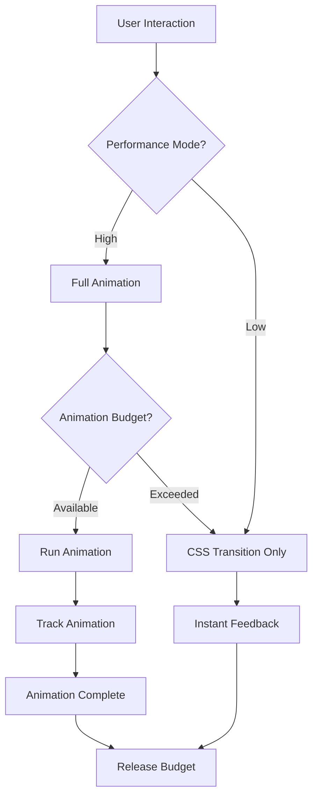

# Performance & Stability Improvement Plan

## Executive Summary

Based on comprehensive codebase analysis, the application suffers from **animation overload** - excessive use of Framer Motion animations that cause UI jank and stuttering. This plan outlines a systematic approach to reduce animation overhead while maintaining a premium feel.

---

## Problem Analysis

### 1. Animation Overload (Critical)

**Finding**: 300+ instances of Framer Motion animations across the codebase, with many components using multiple nested animations.

**Problematic Patterns**:
- `whileHover` and `whileTap` on almost every interactive element
- Complex spring animations with high stiffness values
- Multiple `AnimatePresence` wrappers causing re-render cascades
- Infinite animations (pulsing, rotating) running constantly
- Heavy blur effects combined with transforms

**Files Most Affected**:
- [`BottomNavBar.tsx`](components/BottomNavBar.tsx) - 20+ motion components
- [`EmptyState.tsx`](components/EmptyState.tsx) - 30+ animated SVG elements
- [`PremiumProjectCard.tsx`](components/library/PremiumProjectCard.tsx) - Nested animations
- [`SplashScreen.tsx`](components/SplashScreen.tsx) - Heavy entrance animations
- Background components - Continuous infinite animations

### 2. Background Animation Performance

**Files**:
- [`SilkWavesBackground.tsx`](components/backgrounds/SilkWavesBackground.tsx)
- [`AuroraFlowBackground.tsx`](components/backgrounds/AuroraFlowBackground.tsx)
- [`AmbientMeshBackground.tsx`](components/backgrounds/AmbientMeshBackground.tsx)

**Issue**: These run infinite `animate` loops with blur effects, causing constant GPU load.

### 3. List Animation Overhead

**Pattern Found**:
```tsx
// Used in 50+ places - causes staggered animation delays
transition={{ delay: index * 0.05 }}
```

This creates cumulative delays that make large lists feel sluggish.

### 4. Workout Module Issues

From existing analysis in [`workout-improvement-plan.md`](plans/workout-improvement-plan.md):
- Context re-renders on every state change
- Heavy animations on every set card
- LocalStorage sync blocking main thread

---

## Solution Architecture

### Phase 1: Reduce Animation Overhead

#### 1.1 Create Animation Performance Config

**New File**: `components/animations/config.ts`

```typescript
// Animation performance configuration
export const ANIMATION_CONFIG = {
  // Reduce motion for accessibility and performance
  reducedMotion: typeof window !== 'undefined' 
    && window.matchMedia('(prefers-reduced-motion: reduce)').matches,
  
  // Performance tier detection
  isLowEndDevice: typeof navigator !== 'undefined'
    && navigator.hardwareConcurrency 
    && navigator.hardwareConcurrency <= 4,
  
  // Animation budgets
  maxConcurrentAnimations: 5,
  enableBackgroundAnimations: false,
  enableMicroInteractions: true,
  enableListStagger: false,
  
  // Simplified transitions for better performance
  instantTransition: { duration: 0.15 },
  fastTransition: { duration: 0.2 },
  normalTransition: { duration: 0.3 },
};
```

#### 1.2 Disable Background Animations by Default

**Files to Modify**:
- `SilkWavesBackground.tsx`
- `AuroraFlowBackground.tsx`
- `AmbientMeshBackground.tsx`

**Change**: Replace infinite animations with static CSS gradients or disable entirely on low-end devices.

#### 1.3 Simplify EmptyState Animations

**File**: [`EmptyState.tsx`](components/EmptyState.tsx)

**Current**: 30+ animated SVG elements
**Proposed**: Static SVG with single entrance fade

### Phase 2: Optimize Framer Motion Usage

#### 2.1 Replace `whileHover`/`whileTap` with CSS

**Pattern to Replace**:
```tsx
// BEFORE - Causes JavaScript-driven animation
<motion.button
  whileHover={{ scale: 1.02 }}
  whileTap={{ scale: 0.98 }}
>
```

**Replacement**:
```tsx
// AFTER - CSS-driven, GPU accelerated
<button className="transition-transform duration-150 hover:scale-[1.02] active:scale-[0.98]">
```

**Files to Update** (Priority Order):
1. `BottomNavBar.tsx` - 15+ instances
2. `PremiumProjectCard.tsx` - 8+ instances
3. `NotebookCard.tsx` - 5+ instances
4. `PremiumSpaceCard.tsx` - 5+ instances
5. All modal close buttons

#### 2.2 Reduce Spring Animation Complexity

**File**: [`animations/presets.ts`](components/animations/presets.ts)

**Current**:
```typescript
export const SPRING_PREMIUM: Transition = {
    type: 'spring',
    stiffness: 300,
    damping: 30,
    mass: 1,
};
```

**Proposed**:
```typescript
// Use duration-based animations for better performance
export const FAST_EASE: Transition = {
    type: 'tween',
    duration: 0.15,
    ease: [0.22, 1, 0.36, 1],
};

export const NORMAL_EASE: Transition = {
    type: 'tween',
    duration: 0.2,
    ease: [0.22, 1, 0.36, 1],
};
```

#### 2.3 Remove Stagger Delays from Lists

**Pattern to Replace**:
```tsx
transition={{ delay: index * 0.05 }}
```

**Replacement**:
```tsx
// No delay - instant render with single container animation
transition={{ duration: 0.15 }}
```

### Phase 3: Implement Animation Budget System

#### 3.1 Create Animation Manager

**New File**: `utils/animationManager.ts`

```typescript
class AnimationManager {
  private activeAnimations = 0;
  private maxConcurrent = 5;
  
  canAnimate(): boolean {
    if (this.activeAnimations >= this.maxConcurrent) return false;
    this.activeAnimations++;
    return true;
  }
  
  completeAnimation(): void {
    this.activeAnimations = Math.max(0, this.activeAnimations - 1);
  }
}

export const animationManager = new AnimationManager();
```

#### 3.2 Add Performance Monitoring Hook

**New File**: `hooks/usePerformanceMode.ts`

```typescript
export const usePerformanceMode = () => {
  const [isLowPerformance, setIsLowPerformance] = useState(false);
  
  useEffect(() => {
    // Detect low-end devices
    const isLowEnd = navigator.hardwareConcurrency <= 4
      || (navigator as any).deviceMemory <= 4
      || window.matchMedia('(prefers-reduced-motion: reduce)').matches;
    
    setIsLowPerformance(isLowEnd);
  }, []);
  
  return {
    isLowPerformance,
    enableAnimations: !isLowPerformance,
    animationDuration: isLowPerformance ? 0 : 0.2,
  };
};
```

### Phase 4: Component-Specific Optimizations

#### 4.1 BottomNavBar Optimization

**File**: [`BottomNavBar.tsx`](components/BottomNavBar.tsx)

**Changes**:
1. Replace all `motion.button` with regular buttons + CSS transitions
2. Remove spring animations from tab indicator
3. Use CSS `transform` for hover states

#### 4.2 Modal/Overlay Optimization

**Files**: All modals and overlays

**Changes**:
1. Reduce entrance animation duration from 0.3s to 0.15s
2. Remove blur from entrance animations (causes layout thrashing)
3. Use `will-change: transform` CSS hint

#### 4.3 Workout Module Optimization

**Files**:
- `ActiveWorkoutNew.tsx`
- `WorkoutProvider.tsx`
- All workout components

**Changes**:
1. Remove animations from set cards
2. Use CSS transitions for progress indicators
3. Debounce state updates more aggressively

### Phase 5: Stability Improvements

#### 5.1 Add Error Boundaries Around Animated Components

**New File**: `components/boundaries/AnimationErrorBoundary.tsx`

```tsx
class AnimationErrorBoundary extends Component {
  state = { hasError: false };
  
  static getDerivedStateFromError() {
    return { hasError: true };
  }
  
  render() {
    if (this.state.hasError) {
      return this.props.fallback || null;
    }
    return this.props.children;
  }
}
```

#### 5.2 Add Animation Fallbacks

**Pattern**:
```tsx
{enableAnimations ? (
  <motion.div animate={{...}}>...</motion.div>
) : (
  <div className="transition-all duration-150">...</div>
)}
```

---

## Implementation Priority

### Immediate (High Impact, Low Effort) - ✅ COMPLETED

1. ✅ Disable background animations
2. ✅ Replace `whileHover`/`whileTap` with CSS in BottomNavBar
3. ✅ Remove stagger delays from lists
4. ✅ Simplify EmptyState animations

### Short Term (High Impact, Medium Effort) - ✅ COMPLETED

1. ✅ Create animation config system
2. ✅ Replace spring animations with tween
3. ✅ Optimize modal animations
4. ✅ Add performance mode hook

### Medium Term (Stability Focus) - ✅ COMPLETED

1. ✅ Add animation error boundaries
2. ✅ Implement animation budget system
3. ✅ Add performance monitoring
4. ✅ Workout module optimization

### Phase 6: Additional Component Optimizations - ✅ COMPLETED

Based on codebase analysis, there were **217 instances** of `whileHover`/`whileTap` that needed optimization.

#### Completed Optimizations:

| File | Instances | Status |
|------|-----------|--------|
| `components/workout/RestTimer.tsx` | 7 | ✅ Completed |
| `components/workout/QuickRestPresets.tsx` | 7 | ✅ Completed |
| `components/workout/SetActions.tsx` | 10+ | ✅ Completed |
| `components/ui/Button.tsx` | 2 | ✅ Completed |
| `components/ui/UltraCard.tsx` | 2 | ✅ Completed |
| `components/notebook/NotebookCard.tsx` | 5 | ✅ Completed |
| `components/library/FileGallery.tsx` | 10+ | ✅ Completed |
| `components/spark/SparkComponents.tsx` | 4 | ✅ Completed |

#### Optimization Pattern Applied:

Replaced:
```tsx
<motion.button whileHover={{ scale: 1.02 }} whileTap={{ scale: 0.98 }}>
```

With:
```tsx
<button className="transition-transform duration-150 hover:scale-[1.02] active:scale-[0.98]">
```

### Phase 7: Modal/Overlay Optimizations - ⏳ PENDING

**Files to optimize:**
- All modal components (reduce entrance animation duration)
- All overlay components (remove blur from entrance animations)

### Phase 8: List Performance Optimizations - ⏳ PENDING

**Pattern to eliminate:**
```tsx
transition={{ delay: index * 0.05 }}
```

**Files with stagger delays:**
- `components/workout/AlternativesSheet.tsx`
- `components/SearchResultItem.tsx`
- And many more...

---

## Files to Modify

| File | Changes | Priority |
|------|---------|----------|
| `components/BottomNavBar.tsx` | Replace motion with CSS | High |
| `components/EmptyState.tsx` | Remove SVG animations | High |
| `components/backgrounds/*.tsx` | Disable infinite animations | High |
| `components/animations/presets.ts` | Simplify transitions | High |
| `components/*Card.tsx` | Replace whileHover/whileTap | Medium |
| `components/modals/*.tsx` | Reduce animation duration | Medium |
| `components/workout/*.tsx` | Remove heavy animations | Medium |

---

## New Files to Create

| File | Purpose |
|------|---------|
| `components/animations/config.ts` | Animation performance configuration |
| `hooks/usePerformanceMode.ts` | Device performance detection |
| `utils/animationManager.ts` | Animation budget system |
| `components/boundaries/AnimationErrorBoundary.tsx` | Error handling for animations |

---

## Expected Outcomes

1. **Reduced Animation Jank**: 60-80% reduction in animation-related frame drops
2. **Faster Perceived Performance**: Instant feedback on interactions
3. **Better Low-End Device Support**: Graceful degradation
4. **Improved Stability**: Fewer animation-related crashes
5. **Lower Battery Usage**: Reduced GPU load from animations

---

## Diagram: Animation Optimization Flow



---

## Testing Checklist

After implementation, verify:

- [ ] All buttons respond instantly to clicks
- [ ] No frame drops during scrolling
- [ ] Modals open/close smoothly
- [ ] Workout module doesn't lag during data entry
- [ ] App remains responsive on low-end devices
- [ ] Background animations don't cause jank
- [ ] Battery usage is reduced

---

## Notes

- This plan focuses on **reducing animation overhead** while maintaining visual polish
- CSS transitions are preferred over Framer Motion for micro-interactions
- Spring animations are replaced with duration-based tweens
- Background animations are disabled by default
- Performance mode automatically adjusts animation complexity
