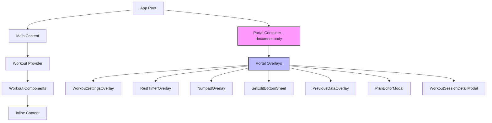
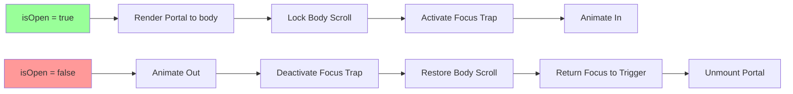

# Portal Overlay Refactor Plan

## Overview

רכיבי UI שדורשים השתלטות על המסך (Modals, Overlays, Tooltips) צריכים להיות מנותקים מעץ ה-DOM הראשי באמצעות Portals כדי להימנע מבעיות Containing Blocks ו-Stacking Contexts. ניתוק כזה מחייב לקיחת אחריות ידנית על נעילת הגלילה של ה-Body וניהול הפוקוס.

## Current State Analysis

### Components Already Using Portals
- [`ModalOverlay.tsx`](components/ui/ModalOverlay.tsx) - Has portal support with `usePortal` prop
- [`ExerciseReorder.tsx`](components/workout/ExerciseReorder.tsx) - Uses `createPortal`
- [`SettingsSheet.tsx`](components/settings/SettingsSheet.tsx) - Uses `createPortal`
- [`LongPressMenu.tsx`](components/ui/LongPressMenu.tsx) - Uses `createPortal`
- [`OnboardingTour.tsx`](components/onboarding/OnboardingTour.tsx) - Uses `createPortal`
- [`LegalModals.tsx`](components/LegalModals.tsx) - Uses `createPortal`
- [`FeedbackModal.tsx`](components/FeedbackModal.tsx) - Uses `createPortal`
- [`ItemCreationForm.tsx`](components/ItemCreationForm.tsx) - Uses `createPortal` for mobile

### Components Missing Portals (Need Refactoring)

#### Workout Components
| Component | Current Z-Index | Has Scroll Lock | Has Focus Trap |
|-----------|-----------------|-----------------|----------------|
| [`WorkoutSettingsOverlay.tsx`](components/workout/overlays/WorkoutSettingsOverlay.tsx) | z-[10000] | ❌ No | ❌ No |
| [`RestTimerOverlay.tsx`](components/workout/overlays/RestTimerOverlay.tsx) | z-[10000] | ❌ No | ❌ No |
| [`NumpadOverlay.tsx`](components/workout/overlays/NumpadOverlay.tsx) | z-[10000] | ❌ No | ❌ No |
| [`SetEditBottomSheet.tsx`](components/workout/components/SetEditBottomSheet.tsx) | z-[9998]/z-[9999] | ❌ No | ❌ No |
| [`PreviousDataOverlay.tsx`](components/workout/PreviousDataOverlay.tsx) | z-[10001] | ❌ No | ❌ No |
| [`PlanEditorModal.tsx`](components/workout/PlanEditorModal.tsx) | z-[100000] | ❌ No | ❌ No |

#### Fitness Components
| Component | Current Z-Index | Has Scroll Lock | Has Focus Trap |
|-----------|-----------------|-----------------|----------------|
| [`WorkoutSessionDetailModal.tsx`](components/library/fitness/WorkoutSessionDetailModal.tsx) | z-[10000] | ❌ No | ❌ No |

### Existing Infrastructure

#### useFocusTrap Hook
Located at [`hooks/useFocusTrap.ts`](hooks/useFocusTrap.ts):
- ✅ Focus trapping within container
- ✅ Escape key handling
- ✅ Click outside handling
- ✅ Scroll lock support
- ✅ Auto-focus first element
- ✅ Focus restoration on close

#### ModalOverlay Component
Located at [`components/ui/ModalOverlay.tsx`](components/ui/ModalOverlay.tsx):
- ✅ Portal rendering via `createPortal`
- ✅ Scroll lock
- ✅ Escape key handling
- ✅ Animation variants (modal, bottomSheet)
- ✅ Backdrop configuration

## Solution Design

### Option A: Enhance ModalOverlay Component
Extend the existing [`ModalOverlay.tsx`](components/ui/ModalOverlay.tsx) to include focus trap integration.

### Option B: Create New PortalOverlay Component
Create a new component that combines:
- Portal rendering
- Scroll lock
- Focus trap
- Animation variants

**Recommendation: Option A** - Enhance the existing `ModalOverlay` component to avoid duplication and maintain consistency.

### Enhanced ModalOverlay API

```typescript
interface ModalOverlayProps {
  isOpen: boolean;
  onClose?: () => void;
  children: React.ReactNode;
  
  // Z-index management
  zLevel?: 'default' | 'high' | 'ultra' | 'extreme';
  
  // Portal options
  usePortal?: boolean; // default: true
  
  // Scroll lock
  lockScroll?: boolean; // default: true
  
  // Focus management
  trapFocus?: boolean; // default: true
  autoFocus?: boolean; // default: true
  restoreFocus?: boolean; // default: true
  initialFocusSelector?: string;
  
  // Animation
  variant?: 'modal' | 'bottomSheet' | 'fullscreen' | 'none';
  animationDuration?: number;
  
  // Backdrop
  backdropOpacity?: 50 | 60 | 70 | 80 | 90 | 95;
  blur?: 'none' | 'sm' | 'md' | 'xl';
  closeOnBackdropClick?: boolean; // default: true
  closeOnEscape?: boolean; // default: true
  
  // Accessibility
  ariaLabel?: string;
  ariaDescribedBy?: string;
}
```

## Implementation Plan

### Phase 1: Enhance ModalOverlay Component
- [ ] Add `useFocusTrap` integration to `ModalOverlay.tsx`
- [ ] Add `fullscreen` variant for full-screen overlays
- [ ] Add `trapFocus`, `autoFocus`, `restoreFocus` props
- [ ] Add `closeOnBackdropClick` prop
- [ ] Ensure all props are optional with sensible defaults

### Phase 2: Refactor Workout Overlays

#### 2.1 WorkoutSettingsOverlay
- Current: Uses `AnimatePresence` with inline `fixed inset-0`
- Target: Wrap with `ModalOverlay` variant="bottomSheet"
- Props needed: `trapFocus`, `lockScroll`, `closeOnBackdropClick`

#### 2.2 RestTimerOverlay
- Current: Uses `AnimatePresence` with inline `fixed inset-0`
- Target: Wrap with `ModalOverlay` variant="fullscreen" for full mode
- Special: Mini timer mode should remain inline

#### 2.3 NumpadOverlay
- Current: Uses `AnimatePresence` with inline `fixed inset-0`
- Target: Wrap with `ModalOverlay` variant="bottomSheet"

#### 2.4 SetEditBottomSheet
- Current: Uses `AnimatePresence` with inline `fixed inset-0`
- Target: Wrap with `ModalOverlay` variant="bottomSheet"

#### 2.5 PreviousDataOverlay
- Current: Uses `AnimatePresence` with inline `fixed inset-0`
- Target: Wrap with `ModalOverlay` variant="modal"

#### 2.6 PlanEditorModal
- Current: Uses inline `fixed inset-0` without AnimatePresence
- Target: Wrap with `ModalOverlay` variant="fullscreen"

### Phase 3: Refactor Fitness Overlays

#### 3.1 WorkoutSessionDetailModal
- Current: Uses `AnimatePresence` with inline `fixed inset-0`
- Target: Wrap with `ModalOverlay` variant="modal"

### Phase 4: Testing & Validation
- [ ] Test z-index stacking in all contexts
- [ ] Test scroll lock on various devices
- [ ] Test focus trap with keyboard navigation
- [ ] Test escape key handling
- [ ] Test backdrop click closing
- [ ] Test with screen readers
- [ ] Test animations work correctly with Portal

## Z-Index Strategy

Use the existing [`constants/zIndex.ts`](constants/zIndex.ts) for consistent z-index values:

```typescript
// Current Z_INDEX values
export const Z_INDEX = {
  modal: 1000,
  alert: 1100,
  splash: 2000,
  // ... other values
};
```

All overlays should use these standardized values instead of hardcoded z-[10000].

## Migration Pattern

### Before (Current Pattern)
```tsx
const MyOverlay = ({ isOpen, onClose }) => (
  <AnimatePresence>
    {isOpen && (
      <motion.div
        className="fixed inset-0 z-[10000] bg-black/80"
        onClick={onClose}
      >
        <motion.div
          initial={{ y: '100%' }}
          animate={{ y: 0 }}
          exit={{ y: '100%' }}
          onClick={e => e.stopPropagation()}
        >
          {/* content */}
        </motion.div>
      </motion.div>
    )}
  </AnimatePresence>
);
```

### After (With ModalOverlay)
```tsx
import { ModalOverlay } from '../ui/ModalOverlay';

const MyOverlay = ({ isOpen, onClose }) => (
  <ModalOverlay
    isOpen={isOpen}
    onClose={onClose}
    variant="bottomSheet"
    trapFocus
    lockScroll
  >
    {/* content */}
  </ModalOverlay>
);
```

## File Structure

```
components/
├── ui/
│   ├── ModalOverlay.tsx       # Enhance with focus trap
│   └── ...
├── workout/
│   ├── overlays/
│   │   ├── WorkoutSettingsOverlay.tsx  # Refactor
│   │   ├── RestTimerOverlay.tsx        # Refactor
│   │   ├── NumpadOverlay.tsx           # Refactor
│   │   └── ...
│   ├── components/
│   │   ├── SetEditBottomSheet.tsx      # Refactor
│   │   └── ...
│   ├── PreviousDataOverlay.tsx         # Refactor
│   └── PlanEditorModal.tsx             # Refactor
└── library/
    └── fitness/
        └── WorkoutSessionDetailModal.tsx # Refactor
```

## Acceptance Criteria

1. ✅ All overlays render via Portal to `document.body`
2. ✅ Body scroll is locked when any overlay is open
3. ✅ Focus is trapped within the overlay when open
4. ✅ Focus returns to trigger element when closed
5. ✅ Escape key closes the overlay
6. ✅ No z-index conflicts with navigation or other UI elements
7. ✅ Animations work correctly with Portal
8. ✅ All existing functionality preserved
9. ✅ Accessibility attributes properly set
10. ✅ Works on mobile and desktop

## Diagram: Component Hierarchy



## Diagram: ModalOverlay Component Flow



## Risk Assessment

| Risk | Impact | Mitigation |
|------|--------|------------|
| Breaking existing animations | Medium | Test each component after refactor |
| Focus trap conflicts | Low | Use existing `useFocusTrap` hook |
| Z-index conflicts | Low | Use standardized Z_INDEX constants |
| Mobile gesture issues | Medium | Test on mobile devices |
| Performance regression | Low | Portal has minimal overhead |

## Estimated Effort

- Phase 1: Enhance ModalOverlay - 1 component
- Phase 2: Refactor Workout Overlays - 6 components
- Phase 3: Refactor Fitness Overlays - 1 component
- Phase 4: Testing - All components

Total: 8 components to update + 1 component to enhance
