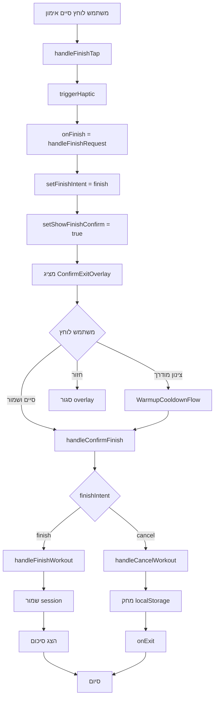

# תוכנית תיקון זרימת סיום/ביטול אימון
# Workout Finish/Cancel Flow Fix Plan

## בעיה נוכחית

המשתמש מדווח שכפתורי סיום וביטול האימון לא מגיבים, והאימונים לא נשמרים/נמחקים כראוי.

## ניתוח הזרימה הנוכחית

### זרימת סיום אימון (Finish)
```
1. משתמש לוחץ "סיים אימון" ב-WorkoutHeader
2. handleFinishTap() - דורש DOUBLE-TAP ❌ בעיה!
3. אחרי double-tap → onFinish() → handleFinishRequest()
4. handleFinishRequest() בודק cooldownPreference
5. אם 'always' או 'ask' → מציג WarmupCooldownFlow
6. אחרי cooldown/skip → setFinishIntent('finish') + setShowFinishConfirm(true)
7. מציג ConfirmExitOverlay
8. משתמש לוחץ "סיים ושמור" → handleConfirmFinish()
9. handleConfirmFinish() שומר את הסשן ומציג סיכום
```

### זרימת ביטול אימון (Cancel/Discard)
```
1. משתמש לוחץ "בטל אימון" ב-WorkoutHeader
2. handleDiscardTap() - דורש DOUBLE-TAP ❌ בעיה!
3. אחרי double-tap → onDiscard() → handleDiscardRequest()
4. handleDiscardRequest() → setFinishIntent('cancel') + setShowFinishConfirm(true)
5. מציג ConfirmExitOverlay
6. משתמש לוחץ "בטל אימון" → handleConfirmFinish()
7. handleConfirmFinish() מוחק localStorage ויוצא
```

## בעיות שזוהו

### 1. דרישת Double-Tap 🔴 קריטי
**מיקום**: `components/workout/components/WorkoutHeader.tsx:310-346`

הכפתורים דורשים לחיצה כפולה תוך 2 שניות:
```typescript
const handleFinishTap = useCallback(() => {
    if (exitPending) {
        // רק אחרי לחיצה שנייה מבצע את הפעולה
        onFinish();
    } else {
        setExitPending(true);
        // אחרי 2 שניות מאפס את המצב
        exitTimeoutRef.current = setTimeout(() => {
            setExitPending(false);
        }, DOUBLE_TAP_TIMEOUT);
    }
}, [exitPending, onFinish]);
```

**פתרון**: הסר את דרישת ה-double-tap או הפוך אותה לאופציונלית בהגדרות.

### 2. זרימת Cooldown מיותרת 🟡 בינוני
**מיקום**: `components/workout/ActiveWorkoutNew.tsx:327-339`

כשמשתמש לוחץ "סיים אימון", המערכת בודקת אם להציג cooldown:
```typescript
const handleFinishRequest = useCallback(() => {
    const cooldownPreference = workoutSettings.cooldownPreference || 'ask';
    if (cooldownPreference === 'always' || cooldownPreference === 'ask') {
        // מציג cooldown במקום לשאול ישירות
        dispatch({ type: 'SET_MODAL_STATE', payload: { modal: 'cooldown', isOpen: true } });
    } else {
        setFinishIntent('finish');
        setShowFinishConfirm(true);
    }
}, [dispatch, workoutSettings.cooldownPreference]);
```

**פתרון**: הצג את ConfirmExitOverlay ישירות, עם אפשרות לדלג ל-cooldown.

### 3. אין משוב ויזואלי ללחיצה ראשונה 🟡 בינוני
המשתמש לא יודע שצריך ללחוץ פעמיים - אין הודעה ברורה.

---

## תוכנית תיקון

### שלב 1: הסרת דרישת Double-Tap
**קובץ**: `components/workout/components/WorkoutHeader.tsx`

**שינוי**:
```typescript
// לפני (double-tap):
const handleFinishTap = useCallback(() => {
    if (exitPending) {
        onFinish();
    } else {
        setExitPending(true);
        // ...
    }
}, [exitPending, onFinish]);

// אחרי (single-tap + confirmation):
const handleFinishTap = useCallback(() => {
    triggerHaptic('light');
    onFinish();
}, [onFinish]);
```

### שלב 2: פישוט זרימת הסיום
**קובץ**: `components/workout/ActiveWorkoutNew.tsx`

**שינוי**:
```typescript
// לפני:
const handleFinishRequest = useCallback(() => {
    const cooldownPreference = workoutSettings.cooldownPreference || 'ask';
    if (cooldownPreference === 'always' || cooldownPreference === 'ask') {
        dispatch({ type: 'SET_MODAL_STATE', payload: { modal: 'cooldown', isOpen: true } });
    } else {
        setFinishIntent('finish');
        setShowFinishConfirm(true);
    }
}, [dispatch, workoutSettings.cooldownPreference]);

// אחרי:
const handleFinishRequest = useCallback(() => {
    triggerHaptic('light');
    setFinishIntent('finish');
    setShowFinishConfirm(true);
}, []);
```

### שלב 3: הוספת כפתור Cooldown ב-ConfirmExitOverlay
**קובץ**: `components/workout/overlays/ConfirmExitOverlay.tsx`

**שינוי**: הוספת כפתור "צינון מודרך" לפני סיום:
```typescript
{isFinishing && (
    <motion.button
        onClick={onCooldown}  // חדש
        className="w-full py-3.5 rounded-2xl font-bold bg-blue-500/20 text-blue-400 border border-blue-500/40"
    >
        צינון מודרך לפני סיום
    </motion.button>
)}
```

### שלב 4: תיקון handleConfirmFinish
**קובץ**: `components/workout/ActiveWorkoutNew.tsx`

**בעיה**: הפונקציה מורכבת מדי ויש בה מספר נקודות כשל.

**פתרון**: פיצול לפונקציות נפרדות:
```typescript
// פונקציה נפרדת לביטול
const handleCancelWorkout = useCallback(async () => {
    // 1. סמן כהושלם ב-localStorage
    // 2. מחק את ה-state
    // 3. קרא ל-onExit
}, []);

// פונקציה נפרדת לסיום
const handleFinishWorkout = useCallback(async () => {
    // 1. וודא שיש סטים שהושלמו
    // 2. צור session
    // 3. שמור ל-DB
    // 4. הצג סיכום
}, []);

// הפונקציה הראשית
const handleConfirmFinish = useCallback(async () => {
    if (finishIntent === 'cancel') {
        await handleCancelWorkout();
    } else {
        await handleFinishWorkout();
    }
}, [finishIntent, handleCancelWorkout, handleFinishWorkout]);
```

---

## דיאגרמת זרימה מתוקנת



---

## קבצים לשינוי

| קובץ | שינוי | עדיפות |
|------|-------|--------|
| `WorkoutHeader.tsx` | הסר double-tap | 🔴 קריטי |
| `ActiveWorkoutNew.tsx` | פשט זרימת סיום | 🔴 קריטי |
| `ConfirmExitOverlay.tsx` | הוסף כפתור cooldown | 🟡 בינוני |
| `WorkoutSummary.tsx` | וודא סגירה נכונה | 🟢 נמוך |

---

## בדיקות לבצע

### בדיקה 1: סיום אימון רגיל
1. התחל אימון
2. השלם לפחות סט אחד
3. לחץ "סיים אימון" (לחיצה אחת!)
4. וודא ש-ConfirmExitOverlay מופיע
5. לחץ "סיים ושמור"
6. וודא שהסיכום מופיע
7. וודא שהאימון נשמר בהיסטוריה

### בדיקה 2: ביטול אימון
1. התחל אימון
2. השלם כמה סטים
3. לחץ "בטל אימון" (לחיצה אחת!)
4. וודא ש-ConfirmExitOverlay מופיע עם אזהרה
5. לחץ "בטל אימון"
6. וודא שהאימון לא נשמר
7. וודא שהממשק חוזר למסך הראשי

### בדיקה 3: אימון ריק
1. התחל אימון
2. אל תשלים אף סט
3. לחץ "סיים אימון"
4. וודא שהאימון נסגר בלי לשמור סשן ריק

### בדיקה 4: Cooldown
1. התחל אימון
2. השלם כמה סטים
3. לחץ "סיים אימון"
4. לחץ "צינון מודרך"
5. בצע/דלג על cooldown
6. וודא שהסיכום מופיע אחרי cooldown
