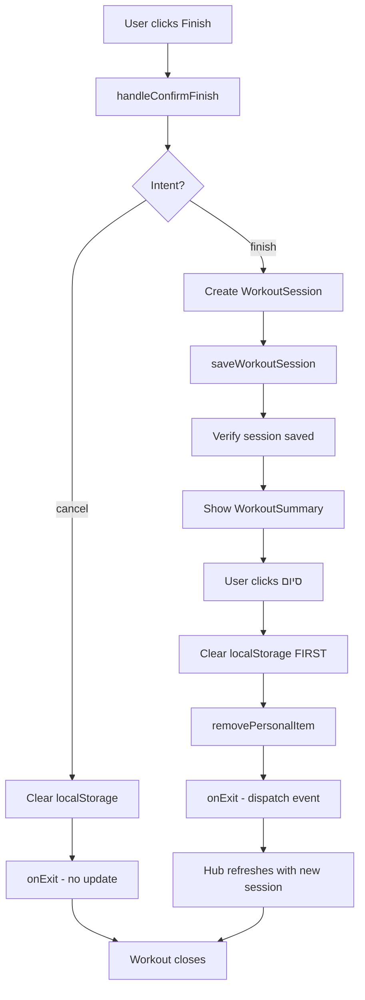

# Workout Issues Fix Plan

## Problem Analysis

### Issue 1: Workout Loop Bug
**Symptom**: When finishing a workout, it reopens and creates an infinite loop that can't be exited.

**Root Cause Analysis**:
The issue is in the interaction between [`ActiveWorkoutNew.tsx`](components/workout/ActiveWorkoutNew.tsx) and [`ActiveWorkoutOverlay.tsx`](components/workout/ActiveWorkoutOverlay.tsx):

1. **Race Condition in Cleanup Flow**:
   - In [`WorkoutSummary.tsx`](components/workout/WorkoutSummary.tsx:465-473), when the user clicks "Finish":
     ```tsx
     onClose={async () => {
         await removePersonalItem(item.id);  // DELETES the item
         localStorage.removeItem('active_workout_v3_state');
         onExit();  // Then calls onExit which tries to UPDATE the deleted item
     }}
     ```
   
   - In [`ActiveWorkoutOverlay.tsx`](components/workout/ActiveWorkoutOverlay.tsx:21-27), `handleExit` tries to update:
     ```tsx
     const handleExit = () => {
         const updates = {
             isActiveWorkout: false,
             workoutEndTime: new Date().toISOString(),
         };
         void updatePersonalItem(activeWorkout.id, updates);  // Item already deleted!
     };
     ```

2. **LocalStorage State Persistence**:
   - [`WorkoutProvider.tsx`](components/workout/core/WorkoutProvider.tsx:27) uses `STORAGE_KEY = 'active_workout_v3_state'`
   - If the state isn't properly cleared before component unmount, it can cause the workout to restore on next render

3. **Multiple Entry Points for Active Workouts**:
   - [`ActiveWorkoutOverlay.tsx`](components/workout/ActiveWorkoutOverlay.tsx:11-13) finds active workouts by:
     ```tsx
     const activeWorkout = personalItems.find(
         item => item.type === 'workout' && item.isActiveWorkout && !item.workoutEndTime
     );
     ```
   - [`WorkoutDetails.tsx`](components/details/WorkoutDetails.tsx:41-44) also manages workout state locally with `showActiveWorkout`

### Issue 2: Workouts Not Saving Properly
**Symptom**: Workouts sometimes get deleted or don't save correctly.

**Root Cause Analysis**:
1. **Confusion Between Session and Item**:
   - `WorkoutSession` is saved correctly via [`saveWorkoutSession()`](services/db/workoutDb.ts:165-179)
   - But `PersonalItem` (the active workout item) is deleted via `removePersonalItem()`
   - This creates inconsistency - the session exists but the source item is gone

2. **No Central Hub Storage**:
   - Workout data is scattered across:
     - `localStorage` (active workout state)
     - IndexedDB `WORKOUT_SESSIONS` (completed sessions)
     - IndexedDB `PERSONAL_ITEMS` (active workout items)
   - No single source of truth for workout history in the hub

---

## Solution Architecture

### Fix 1: Resolve Workout Loop Issue

#### Step 1.1: Fix the Cleanup Flow in ActiveWorkoutNew.tsx
**File**: [`components/workout/ActiveWorkoutNew.tsx`](components/workout/ActiveWorkoutNew.tsx:465-473)

**Current Code**:
```tsx
onClose={async () => {
    await removePersonalItem(item.id);
    localStorage.removeItem('active_workout_v3_state');
    onExit();
}}
```

**Fixed Code**:
```tsx
onClose={async () => {
    // Clear localStorage FIRST to prevent restore
    localStorage.removeItem('active_workout_v3_state');
    
    // Update the item to mark as completed BEFORE deletion
    // This ensures the workout is properly closed
    try {
        await removePersonalItem(item.id);
    } catch (e) {
        console.error('Error removing workout item:', e);
    }
    
    // Call onExit last - it should NOT try to update the deleted item
    onExit();
}}
```

#### Step 1.2: Fix ActiveWorkoutOverlay.tsx handleExit
**File**: [`components/workout/ActiveWorkoutOverlay.tsx`](components/workout/ActiveWorkoutOverlay.tsx:21-27)

**Current Code**:
```tsx
const handleExit = () => {
    const updates = {
        isActiveWorkout: false,
        workoutEndTime: new Date().toISOString(),
    };
    void updatePersonalItem(activeWorkout.id, updates);
};
```

**Fixed Code**:
```tsx
const handleExit = () => {
    // Don't update - the item is already handled in ActiveWorkoutNew
    // Just trigger a refresh of personal items
    window.dispatchEvent(new Event('WORKOUT_COMPLETED'));
};
```

#### Step 1.3: Add Guard in WorkoutProvider
**File**: [`components/workout/core/WorkoutProvider.tsx`](components/workout/core/WorkoutProvider.tsx:59-67)

Add a check to prevent restoring state if workout was completed:

```tsx
const loadState = useCallback((): WorkoutState | null => {
    try {
        const saved = localStorage.getItem(STORAGE_KEY);
        if (saved) {
            const parsed = JSON.parse(saved);
            // Don't restore if workout was marked as completed
            if (parsed._completed) {
                localStorage.removeItem(STORAGE_KEY);
                return null;
            }
            return parsed;
        }
    } catch {
        console.error('Failed to load workout state');
    }
    return null;
}, []);
```

### Fix 2: Centralize Workout Storage in Hub

#### Step 2.1: Create Workout History Hook for Hub
**New File**: `hooks/useWorkoutHistoryHub.ts`

```tsx
/**
 * Central hook for accessing workout history in the hub
 * Combines sessions from IndexedDB with real-time updates
 */
export const useWorkoutHistoryHub = () => {
    const [sessions, setSessions] = useState<WorkoutSession[]>([]);
    const [loading, setLoading] = useState(true);
    
    useEffect(() => {
        const loadSessions = async () => {
            const data = await getWorkoutSessions(50);
            setSessions(data);
            setLoading(false);
        };
        
        loadSessions();
        
        // Listen for workout completion events
        const handleWorkoutSaved = () => loadSessions();
        window.addEventListener('WORKOUT_SAVED', handleWorkoutSaved);
        
        return () => {
            window.removeEventListener('WORKOUT_SAVED', handleWorkoutSaved);
        };
    }, []);
    
    return { sessions, loading, refresh: loadSessions };
};
```

#### Step 2.2: Update FitnessHubView to Use Centralized Data
**File**: [`components/library/fitness/FitnessHubView.tsx`](components/library/fitness/FitnessHubView.tsx)

The hub should display workout history from `useWorkoutHistoryHub` instead of relying on PersonalItems.

#### Step 2.3: Ensure Session is Saved Before Item Deletion
**File**: [`components/workout/ActiveWorkoutNew.tsx`](components/workout/ActiveWorkoutNew.tsx:418-453)

The current flow saves the session before showing summary, which is correct. But we need to ensure the session is verified before cleanup:

```tsx
const handleConfirmFinish = useCallback(async () => {
    if (finishIntent === 'finish') triggerHaptic('success');
    setShowFinishConfirm(false);

    if (finishIntent === 'cancel') {
        localStorage.removeItem('active_workout_v3_state');
        onExit();
        return;
    }

    try {
        const session: WorkoutSession = {
            id: `session_${Date.now()}`,
            userId: 'local_user',
            workoutItemId: item.id,
            startTime: new Date(state.startTimestamp).toISOString(),
            endTime: new Date().toISOString(),
            goalType: workoutSettings.defaultWorkoutGoal,
            exercises: state.exercises.map(ex => ({
                ...ex,
                sets: ex.sets.filter(s => s.completedAt),
            })),
        };

        // Save session and verify it was saved
        await saveWorkoutSession(session);
        
        // Verify session was saved by reading it back
        const savedSessions = await getWorkoutSessions(1);
        const wasSaved = savedSessions.some(s => s.id === session.id);
        
        if (!wasSaved) {
            throw new Error('Session verification failed');
        }

        setCompletedSession(session);
        setShowSummary(true);
    } catch (e) {
        console.error('Failed to save workout:', e);
        // Show error to user
        alert('שגיאה בשמירת האימון. אנא נסה שוב.');
    }
}, [finishIntent, state, item.id, workoutSettings.defaultWorkoutGoal, onExit]);
```

---

## Implementation Order

1. **Fix 1.1**: Update cleanup flow in `ActiveWorkoutNew.tsx`
2. **Fix 1.2**: Update `handleExit` in `ActiveWorkoutOverlay.tsx`
3. **Fix 1.3**: Add guard in `WorkoutProvider.tsx`
4. **Fix 2.3**: Add session verification in `handleConfirmFinish`
5. **Fix 2.1**: Create `useWorkoutHistoryHub` hook
6. **Fix 2.2**: Update `FitnessHubView` to use centralized data

---

## Testing Checklist

After implementation, test the following scenarios:

1. **Finish Workout Flow**:
   - [ ] Complete a workout and click "Finish"
   - [ ] Verify summary shows correctly
   - [ ] Verify clicking "סיום" closes the workout
   - [ ] Verify workout doesn't reopen
   - [ ] Verify localStorage is cleared

2. **Discard Workout Flow**:
   - [ ] Start a workout
   - [ ] Click discard/cancel
   - [ ] Verify workout closes without saving
   - [ ] Verify no ghost workout appears

3. **Session Persistence**:
   - [ ] Complete a workout
   - [ ] Check IndexedDB for saved session
   - [ ] Verify session appears in hub history
   - [ ] Refresh page and verify session still exists

4. **Edge Cases**:
   - [ ] Close browser during workout
   - [ ] Reopen and verify state restoration
   - [ ] Complete workout after restoration
   - [ ] Verify no duplicate sessions

---

## Diagram: Fixed Workout Flow



---

## Files to Modify

| File | Changes |
|------|---------|
| `components/workout/ActiveWorkoutNew.tsx` | Fix cleanup flow, add session verification |
| `components/workout/ActiveWorkoutOverlay.tsx` | Remove redundant update in handleExit |
| `components/workout/core/WorkoutProvider.tsx` | Add guard for completed workouts |
| `hooks/useWorkoutHistoryHub.ts` | New file - centralized workout history |
| `components/library/fitness/FitnessHubView.tsx` | Use centralized history hook |
