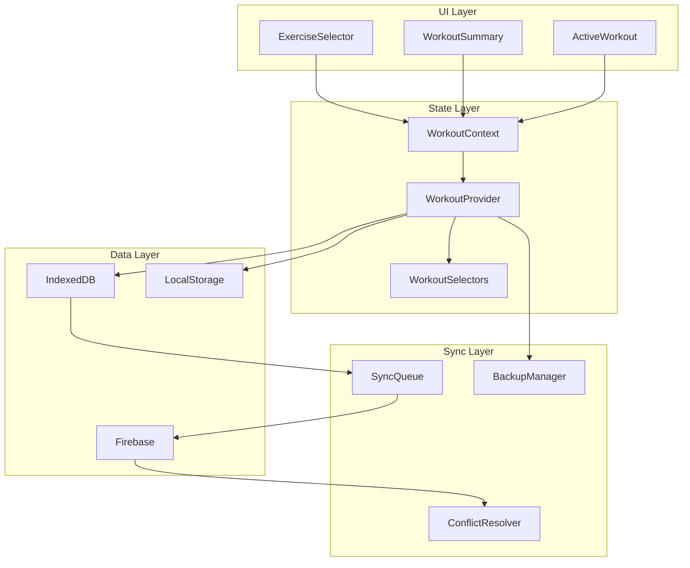

# תוכנית שדרוגים ושיפורים למודול האימון
# Workout Module Upgrade Recommendations

## סיכום השיפורים שבוצעו ✅

### תיקונים שכבר מומשו:
1. **תיקון לופ הסיום** - נוסף `completingWorkoutIds` Set למניעת הצגה חוזרת של אימון בסיום
2. **אימות שמירה** - קריאה חוזרת מהDB לאימות שהסשן נשמר
3. **מצבי טעינה** - הוספת ספינר ומצב שמירה בזמן סיום אימון
4. **הודעות שגיאה** - הצגת שגיאות בצורה ידידותית למשתמש בעברית

---

## תוכנית שדרוגים מומלצת

### שלב 1: יציבות ואמינות 🔒

#### 1.1 מנגנון גיבוי אוטומטי
**בעיה**: אם האפליקציה קורסת באמצע אימון, המשתמש מאבד את כל ההתקדמות.

**פתרון מוצע**:
```
- שמירת snapshot כל 30 שניות ל-IndexedDB
- מנגנון שחזור בטעינת האפליקציה
- הצגת "גילינו אימון לא גמור" עם אפשרות המשך
```

**קבצים לשינוי**:
- `components/workout/core/WorkoutProvider.tsx`
- `services/db/workoutDb.ts` (חדש: `saveWorkoutSnapshot`, `getWorkoutSnapshot`)

#### 1.2 תמיכה Offline מלאה
**בעיה**: אימונים לא נשמרים כשאין חיבור לאינטרנט.

**פתרון מוצע**:
```
- IndexedDB כ-primary storage
- סנכרון עם Firebase כשחוזר החיבור
- אינדיקציית "לא מקוון" ברורה
- תור פעולות ממתינות
```

#### 1.3 Retry Logic לשמירה
**בעיה**: כששמירה נכשלת, המשתמש צריך לנסות שוב ידנית.

**פתרון מוצע**:
```
- 3 ניסיונות אוטומטיים עם exponential backoff
- שמירה מקומית כ-fallback
- כפתור "נסה שוב" במקרה של כשלון
```

---

### שלב 2: ביצועים ⚡

#### 2.1 אופטימיזציה של Context
**בעיה**: כל שינוי קטן מרנדר מחדש את כל רכיבי האימון.

**פתרון מוצע**:
```typescript
// במקום:
const state = useWorkoutState();

// להשתמש בסלקטורים:
const exercises = useWorkoutSelector(s => s.exercises);
const currentExercise = useWorkoutSelector(s => s.exercises[s.currentExerciseIndex]);
```

**קבצים לשינוי**:
- `components/workout/core/WorkoutContext.tsx`
- `components/workout/core/workoutSelectors.ts`

#### 2.2 וירטואליזציה של רשימת תרגילים
**בעיה**: אימון עם 20+ תרגילים גורם ל-lag.

**פתרון מוצע**:
```
- שימוש ב-react-window או react-virtualized
- רינדור רק את התרגילים הנראים
- טעינה דינמית של תרגילים
```

#### 2.3 הפחתת Animations
**בעיה**: אנימציות Framer Motion כבדות על מכשירים חלשים.

**פתרון מוצע**:
```
- CSS animations במקום Framer Motion לאנימציות פשוטות
- כיבוי אנימציות במצב "חסוך סוללה"
- העדפת transform על פני layout changes
```

---

### שלב 3: חוויית משתמש 🎨

#### 3.1 מעברים חלקים
**בעיה**: מעברים פתאומיים בין מסכים.

**פתרון מוצע**:
```
- Fade out בסיום אימון
- Slide transitions בין תרגילים
- Progress indicator בזמן טעינה
- Skeleton loaders במקום ריק
```

#### 3.2 קיצורי מקלדת משופרים
**בעיה**: קשה לנווט מהר באימון.

**פתרון מוצע**:
```
- Enter: סיום סט
- Tab: מעבר לסט הבא
- Arrow keys: ניווט בין תרגילים
- Escape: חזרה/ביטול
- Space: התחלת טיימר מנוחה
```

#### 3.3 תצוגת Progress משופרת
**בעיה**: קשה לראות את ההתקדמות הכללית.

**פתרון מוצע**:
```
- Progress bar עליון עם אחוזים
- מיני מפה של האימון
- זמן משוער שנותר
- קול עידוד באבני דרך
```

---

### שלב 4: תכונות חדשות 🚀

#### 4.1 Superset Support
**תיאור**: אפשרות לקבץ תרגילים שמבוצעים ברצף.

**מימוש מוצע**:
```
- כפתור "צור Superset" בעריכה
- תצוגה מיוחדת ל-superset
- מעבר אוטומטי בין תרגילים
- טיימר משותף
```

#### 4.2 Rest-Pause & Drop Sets
**תיאור**: תמיכה בטכניקות אימון מתקדמות.

**מימוש מוצע**:
```
- סוגי סט מיוחדים
- טיימר rest-pause אוטומטי
- תיעוד drop sets
- חישוב volume מדויק
```

#### 4.3 Voice Commands
**תיאור**: שליטה קולית באימון.

**מימוש מוצע**:
```
- "סט הבא" / "סט קודם"
- "סיים תרגיל"
- "כמה זמן נשאר"
- "מה המשקל הקודם"
```

#### 4.4 Smart Suggestions
**תיאור**: המלצות חכמות במהלך האימון.

**מימוש מוצע**:
```
- הצעת משקל על סמך היסטוריה
- זיהוי under-training / over-training
- המלצת תרגילים משלימים
- אזהרה על עומס יתר
```

---

### שלב 5: אינטגרציה עם Hub 🏠

#### 5.1 סנכרון מלא עם Hub
**בעיה**: אימונים לא תמיד מופיעים ב-Hub.

**פתרון מוצע**:
```
- Event-based sync במקום polling
- Conflict resolution
- Merge strategy למקרה של עריכה ממקומות שונים
```

#### 5.2 Widget ל-Home Screen
**תיאור**: Widget קטן עם סטטיסטיקות אימון.

**מימוש מוצע**:
```
- סטריק שבועי
- נפח אימון אחרון
- זמן עד אימון הבא
- Quick start button
```

#### 5.3 תצוגת היסטוריה משופרת
**בעיה**: קשה לראות התקדמות לאורך זמן.

**פתרון מוצע**:
```
- גרפים אינטראקטיביים
- השוואת תקופות
- חיפוש בהיסטוריה
- ייצוא ל-PDF/CSV
```

---

## סדר עדיפויות מומלץ

| עדיפות | תכונה | השפעה | מורכבות |
|--------|-------|-------|---------|
| 🔴 גבוה | מנגנון גיבוי אוטומטי | גבוהה | בינונית |
| 🔴 גבוה | Retry Logic | גבוהה | נמוכה |
| 🟡 בינונית | אופטימיזציית Context | גבוהה | בינונית |
| 🟡 בינונית | מעברים חלקים | בינונית | נמוכה |
| 🟡 בינונית | סנכרון Hub | גבוהה | גבוהה |
| 🟢 נמוכה | Superset Support | בינונית | גבוהה |
| 🟢 נמוכה | Voice Commands | נמוכה | גבוהה |
| 🟢 נמוכה | Smart Suggestions | בינונית | גבוהה |

---

## דיאגרמת ארכיטקטורה מוצעת



---

## קבצים ליצירה/שינוי

### קבצים חדשים מומלצים:
1. `services/db/backupDb.ts` - ניהול גיבויים
2. `components/workout/core/WorkoutSelectors.tsx` - סלקטורים מותאמים
3. `components/workout/hooks/useWorkoutSync.ts` - סנכרון
4. `components/workout/components/SupersetIndicator.tsx` - תצוגת Superset
5. `components/workout/components/VoiceControl.tsx` - בקרה קולית

### קבצים לשינוי:
1. `components/workout/core/WorkoutProvider.tsx` - הוספת גיבוי
2. `components/workout/core/WorkoutContext.tsx` - סלקטורים
3. `components/workout/ActiveWorkoutNew.tsx` - מעברים
4. `hooks/useWorkoutHistoryHub.ts` - סנכרון
5. `services/dataService.ts` - retry logic

---

## סיכום

המודול כבר עבר שיפורים משמעותיים בתחום היציבות. השלבים הבאים צריכים להתמקד ב:

1. **אמינות** - גיבוי אוטומטי ותמיכה offline
2. **ביצועים** - אופטימיזציה של רינדור
3. **חוויית משתמש** - מעברים חלקים וקיצורי מקלדת
4. **תכונות** - Superset, טכניקות מתקדמות
5. **אינטגרציה** - סנכרון מלא עם Hub
